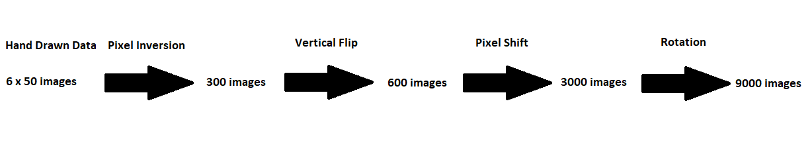

# Handwritten-Calculator
Calculates hand written operations using a convolutional neural network trained on the MNIST dataset.

## Introduction
Many handwritten calculators based on the MNIST dataset have been created by amateur machine learning enthusiasts and are available online. However, none follow a rigorous approach to the problem, which I have attempted to do in the following implementation. This repository will show you step by step how to create such an application: from the data augmentation for the calculator symbols, to creating the user interface using PySimpleGUI.

I have split the problem into three parts: creating the dataset, training the model and then finally building the GUI. Feel free to only read the parts that you are interested in. However, this was written in mind that you read it sequentially, therefore in order to fully understand why things are done the way they are, it is best to read from start to finish.

## 1. Creating the Dataset
The MNIST dataset consists of 60,000 28x28 grayscale images of the digits 0-9, along with a test set of 10,000 images. My first aim was to create a dataset of operations I intended to use in my calculator. The operations I chose to use were: +, -, *, /, (, ). The final dataset had to be of comparable size to that in the MNIST datset - so not to bias the trained neural network. 

If each operation was hand drawn 50 times, then using various transformations (discussed later) we could turn the 50 images to 1500 unique images of each operation. This would mean we could repeat each unique image just 4 times in order to get a somewhat similar representation of each operation to the representation of each number in the MNIST dataset. In my opinion repeating each image 4 times was acceptably low. Considering the final accuracy of the trained model on the test set was 0.9941, the time required to hand draw more operations would not be worth the marginal increase in accuracy.

The first transformation applied to the dataset is a pixel inversion. This is not to increase the number of unique examples, but by inverting the pixel intensities we improve performance due to data centering, (the mean is close to 0). This is explained further in: https://stats.stackexchange.com/questions/220164/impact-of-inverting-grayscale-values-on-mnist-dataset.

The second transformation is vertically flipping every image. This was achieved by flipping them along the horizontal axis, thus we can double the number of images in the original dataset from 50 to 100 (including the unflipped images). The divide symbol used is '/', this is obviously not vertically symmetric. Therefore, the divide symbols were flipped along the vertical axis too, (in essence a 180 degree rotation).

The next set of transformations applied to the dataset are pixel shifts. Each of the original images is shifted by 1 pixel up, down, left and right. This results in the dataset of 100 images becoming 500 images (including the unshifted images).

The last transformation I performed was a rotation. Each image was rotated 10 degrees clockwise and 10 degrees anticlockwise. This tripled the number of images (inlcuding the un-rotated images).

***Visualisation of Transformations***

The final step was to repeat this dataset 4 times in order for a similar representation of the operations as the numbers in the MNIST dataset, join the two datasets and lastly shuffle them.

## 2. Training the Model
The architecture I chose to use in my neural network is based on Yann LeCunn's LeNet-5: http://yann.lecun.com/exdb/lenet/index.html.
It is possibley the most widely known CNN architecture and results in a very high accuracy. Due to the high accuracy, it does not make sense to deviate from the architecture of LeNet-5 in this situation.

***Neural Network Architecture***

There are a few details to be noted about LeNet-5:
* The images in our dataset are 28x28 pixels, but they are zero padded to 32x32 and normalised before being fed into the network.
* We use average pooling instead of the more common max pooling.
* Each output neuron outputs the square of the Euclidian distance between its input vector and weight vector, rather than computing the matrix multiplcation of the inputs and the weight vector.

Using a training set size of 70,000, a validation set size of 20,000 and test set size of 16,000. This model achieved an accuracy of 0.9941 when evaluating on the test set. This was a level of accuracy I was looking for, so I didn't use gridsearchcv to find more optimal parameters.

## 3. Creating the GUI

*(GIF coming soon)*

With regards to what GUI to use, there are two options available: Tkinter or PySimpleGUI. I chose to do the latter because in my opinion the code is a lot cleaner visually.
The GUI is composed of 4 windows, from top to bottom: the calculator name, the  calculator display, the canvas to draw on and the clear canvas button. 

In order to identify and separate each symbol drawn, I have used connected components labelling. This is why I had to use '/' for division instead of the conventional symbol. A better and more 'state of the art' way to classify multiple images in a single image would be to use the You-Only-Look-Once (YOLO) algorithm. I did not choose to do this because connected components labelling works fine in my situation as all the symbols used are made up of a single block. If I were to include '=' as one of the symbols I would then have to use YOLO as the method for identification.

Once the model has predicted each symbol, the operation is calculated and the display window updated.

## 4. Further Information

* When creating this application a lot of ideas were influenced by the following implementation: https://github.com/irfanchahyadi/Handwriting-Calculator 
* The font for the calculator display window can be found at: https://www.1001fonts.com/digital-7-font.html.

